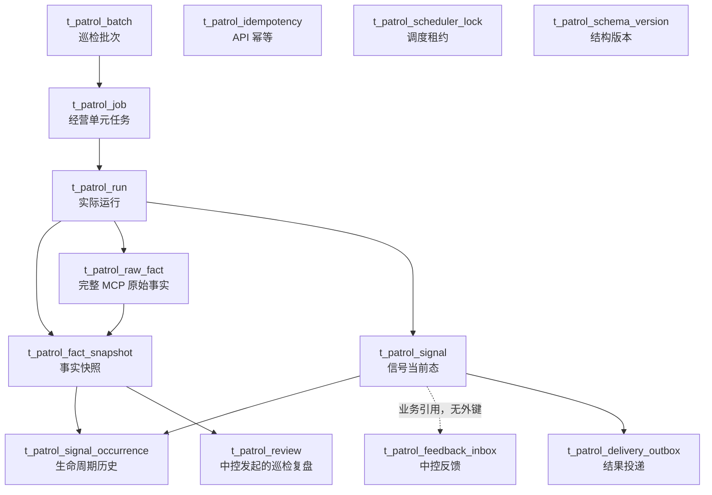

# 巡检 Agent V2 数据库表结构与字段说明

> 更新日期：2026-08-06  
> 适用项目：`weilai-HealthCheck-Agent-v2.0`  
> 数据库：MySQL 8.0.46  
> 当前 Schema Revision：`0010_product_image_cache`

## 1. 数据库概况

巡检 Agent V2 当前共部署 20 张 `t_patrol_*` 表，统一使用 InnoDB、`utf8mb4` 字符集和
`utf8mb4_bin` 排序规则。

数据库负责以下能力：

- 巡检批次调度与任务领取；
- 每次巡检运行及事实快照留存；
- 异常信号当前态和生命周期历史；
- 巡检结果可靠投递及中控反馈接收；
- API 幂等和多实例 Scheduler 租约控制；
- Schema 版本管理。

当前数据库不负责保存经营模式决策、方案审批、建议执行记录，也不创建或修改任何
`t_ops_*` 表。

产品主图只接受前台详情/Pangolin 明确识别的产品图片；`az_extend_detail.IMAGE_URL`
属于店铺 Logo，不进入产品主图缓存。新采集图片为空或前台爬虫失败时，保留并继续使用
最近一次非空主图，不用空值覆盖历史快照。

## 2. 表清单

| 分类 | 表名 | 用途 |
|---|---|---|
| 版本管理 | `t_patrol_schema_version` | 记录数据库迁移版本 |
| 调度层 | `t_patrol_batch` | 保存一次巡检业务批次 |
| 调度层 | `t_patrol_job` | 保存经营单元级可领取任务 |
| 执行层 | `t_patrol_run` | 保存 Job 的一次实际运行 |
| 执行层 | `t_patrol_fact_snapshot` | 保存巡检使用的冻结事实快照 |
| 执行层 | `t_patrol_raw_fact` | 保存 MCP 请求和完整原始响应 |
| 信号层 | `t_patrol_signal` | 保存异常信号当前状态 |
| 信号层 | `t_patrol_signal_occurrence` | 保存信号不可变生命周期历史 |
| 外部交互 | `t_patrol_feedback_inbox` | 幂等接收并审计中控反馈 |
| 外部交互 | `t_patrol_delivery_outbox` | 向中控可靠投递巡检结果 |
| 外部交互 | `t_patrol_review` | 保存中控发起的复盘请求与巡检复盘结果 |
| 主数据 | `t_patrol_sys_user` | 保存负责人用户目录 |
| 主数据 | `t_patrol_user_role` | 保存负责人角色目录 |
| 主数据 | `t_patrol_asin_owner` | 保存经营单元负责人关系 |
| 巡检基线 | `t_patrol_category_baseline` | 保存首次观察并待确认的子体类目基准 |
| 巡检基线 | `t_patrol_product_image` | 保存经营单元最近一次非空真实产品主图 |
| 异步事实 | `t_patrol_child_fact_task` | 保存子体扩展事实异步采集任务 |
| 异步事实 | `t_patrol_child_fact_snapshot` | 保存子体扩展事实短期快照 |
| 基础设施 | `t_patrol_idempotency` | 保存 API 幂等请求和响应 |
| 基础设施 | `t_patrol_scheduler_lock` | 保存多实例 Scheduler 租约 |

## 3. 调度层

### 3.1 `t_patrol_batch`：巡检批次

表示一次每日巡检、到期复扫或人工巡检业务批次。

| 字段 | 类型 | 必填 | 说明 |
|---|---|---:|---|
| `batch_id` | `VARCHAR(64)` | 是 | 批次主键 |
| `idempotency_key` | `VARCHAR(191)` | 是 | 批次幂等键，全局唯一 |
| `trigger_type` | `VARCHAR(32)` | 是 | 触发类型 |
| `business_date` | `DATE` | 是 | 业务日期 |
| `scope_json` | `JSON` | 是 | 本次巡检范围 |
| `scope_hash` | `CHAR(64)` | 是 | 巡检范围内容摘要 |
| `rule_bundle_version` | `VARCHAR(128)` | 是 | 规则包版本 |
| `status` | `VARCHAR(24)` | 是 | 批次状态 |
| `total_count` | `UNSIGNED INT` | 是 | 总任务数，默认 0 |
| `pending_count` | `UNSIGNED INT` | 是 | 待执行任务数，默认 0 |
| `running_count` | `UNSIGNED INT` | 是 | 执行中任务数，默认 0 |
| `succeeded_count` | `UNSIGNED INT` | 是 | 成功任务数，默认 0 |
| `failed_count` | `UNSIGNED INT` | 是 | 失败任务数，默认 0 |
| `started_at` | `DATETIME(6)` | 否 | 批次开始时间 |
| `finished_at` | `DATETIME(6)` | 否 | 批次完成时间 |
| `created_at` | `DATETIME(6)` | 是 | 创建时间，默认 UTC 当前时间 |
| `updated_at` | `DATETIME(6)` | 是 | 更新时间，默认 UTC 当前时间 |

关键约束：

- `idempotency_key` 唯一，避免重复创建同一批次；
- `pending_count + running_count + succeeded_count + failed_count <= total_count`；
- 按 `business_date + status` 建立查询索引。

### 3.2 `t_patrol_job`：巡检任务

一个批次按经营单元拆分任务，每个经营单元对应一条可由 Worker 领取的 Job。

| 字段 | 类型 | 必填 | 说明 |
|---|---|---:|---|
| `job_id` | `VARCHAR(64)` | 是 | 任务主键 |
| `batch_id` | `VARCHAR(64)` | 是 | 所属批次 |
| `request_id` | `VARCHAR(191)` | 是 | 请求编号 |
| `operating_unit_id` | `VARCHAR(64)` | 是 | 经营单元编号 |
| `shop_id` | `UNSIGNED BIGINT` | 是 | 店铺 ID |
| `site_code` | `VARCHAR(32)` | 是 | 站点编码 |
| `parent_asin` | `VARCHAR(32)` | 是 | 父 ASIN |
| `parent_seller_sku` | `VARCHAR(128)` | 否 | 父 Seller SKU |
| `shop_account_ref` | `VARCHAR(128)` | 是 | 店铺账号引用 |
| `job_type` | `VARCHAR(32)` | 是 | 任务类型 |
| `status` | `VARCHAR(24)` | 是 | 任务状态 |
| `payload_json` | `JSON` | 是 | 完整任务输入 |
| `result_ref` | `VARCHAR(64)` | 否 | 运行结果引用 |
| `retry_count` | `UNSIGNED INT` | 是 | 当前重试次数，默认 0 |
| `max_retry` | `UNSIGNED INT` | 是 | 最大重试次数，默认 3 |
| `next_retry_at` | `DATETIME(6)` | 否 | 下次允许重试时间 |
| `locked_by` | `VARCHAR(128)` | 否 | 当前领取任务的 Worker |
| `locked_at` | `DATETIME(6)` | 否 | 任务领取时间 |
| `last_error_code` | `VARCHAR(64)` | 否 | 最近错误码 |
| `last_error_message` | `TEXT` | 否 | 最近错误信息 |
| `created_at` | `DATETIME(6)` | 是 | 创建时间 |
| `updated_at` | `DATETIME(6)` | 是 | 更新时间 |

关键约束：

- `batch_id` 外键关联 `t_patrol_batch.batch_id`；
- `batch_id + operating_unit_id` 唯一；
- `retry_count <= max_retry`；
- 为任务领取及经营单元历史查询建立组合索引。

## 4. 巡检执行层

### 4.1 `t_patrol_run`：巡检运行

记录 Job 的一次实际巡检执行。一个任务可以因重试产生多次运行，但每个 `request_id`
只能对应一次运行。

| 字段 | 类型 | 必填 | 说明 |
|---|---|---:|---|
| `run_id` | `VARCHAR(64)` | 是 | 运行主键 |
| `job_id` | `VARCHAR(64)` | 是 | 对应任务 |
| `batch_id` | `VARCHAR(64)` | 是 | 对应批次 |
| `request_id` | `VARCHAR(191)` | 是 | 幂等请求编号，全局唯一 |
| `operating_unit_id` | `VARCHAR(64)` | 是 | 经营单元编号 |
| `trigger_type` | `VARCHAR(32)` | 是 | 触发来源 |
| `status` | `VARCHAR(32)` | 是 | 运行状态 |
| `rule_versions_json` | `JSON` | 是 | 本次使用的规则版本集合 |
| `fact_snapshot_id` | `VARCHAR(64)` | 否 | 本次生成的事实快照引用 |
| `signal_count` | `UNSIGNED INT` | 是 | 发现的信号数量，默认 0 |
| `data_gap_count` | `UNSIGNED INT` | 是 | 数据缺口数量，默认 0 |
| `started_at` | `DATETIME(6)` | 是 | 开始时间 |
| `finished_at` | `DATETIME(6)` | 否 | 完成时间 |
| `error_code` | `VARCHAR(64)` | 否 | 运行错误码 |
| `error_message` | `TEXT` | 否 | 运行错误信息 |
| `created_at` | `DATETIME(6)` | 是 | 创建时间 |
| `updated_at` | `DATETIME(6)` | 是 | 更新时间 |

关键约束：

- `job_id` 外键关联 `t_patrol_job.job_id`；
- `batch_id` 外键关联 `t_patrol_batch.batch_id`；
- `request_id` 全局唯一。

### 4.2 `t_patrol_fact_snapshot`：事实快照

冻结巡检判断时使用的事实摘要、数据质量、数据缺口和来源引用，用于回答“这次判断是
基于什么数据作出的”。事实快照按不可变证据设计。

| 字段 | 类型 | 必填 | 说明 |
|---|---|---:|---|
| `snapshot_id` | `VARCHAR(64)` | 是 | 快照主键 |
| `run_id` | `VARCHAR(64)` | 是 | 所属巡检运行 |
| `operating_unit_id` | `VARCHAR(64)` | 是 | 经营单元编号 |
| `as_of` | `DATE` | 是 | 数据截止日期 |
| `window_start` | `DATETIME(6)` | 否 | 统计窗口开始时间 |
| `window_end` | `DATETIME(6)` | 否 | 统计窗口结束时间 |
| `content_hash` | `CHAR(64)` | 是 | 快照内容摘要 |
| `quality_status` | `VARCHAR(24)` | 是 | 数据质量状态 |
| `completeness_score` | `DECIMAL(5,2)` | 否 | 数据完整度，范围 0–100 |
| `source_refs_json` | `JSON` | 是 | MCP 或其他数据源引用 |
| `data_gaps_json` | `JSON` | 是 | 数据缺口集合 |
| `normalized_summary_json` | `JSON` | 是 | 标准化事实摘要 |
| `raw_reference_json` | `JSON` | 否 | 指向 `t_patrol_raw_fact` 的原始数据引用 |
| `created_at` | `DATETIME(6)` | 是 | 创建时间 |

关键约束：

- `run_id` 外键关联 `t_patrol_run.run_id`；
- `run_id + content_hash` 唯一；
- `completeness_score` 为空或处于 0–100；
- 数据窗口结束时间不得早于开始时间。

### 4.3 `t_patrol_raw_fact`：MCP 原始事实归档

每个 Run、每个 MCP 工具保存一条不可变采集记录。成功调用保存完整请求、完整 MCP 响应
封套及抽取后的数据数组；失败调用保存错误状态和错误信息。该表用于原始数据复查、问题
复现和受控复用。

| 字段 | 类型 | 必填 | 说明 |
|---|---|---:|---|
| `raw_fact_id` | `VARCHAR(64)` | 是 | 原始事实主键 |
| `run_id` | `VARCHAR(64)` | 是 | 所属巡检运行 |
| `snapshot_id` | `VARCHAR(64)` | 否 | 成功生成后关联的事实快照 |
| `operating_unit_id` | `VARCHAR(64)` | 是 | 经营单元编号 |
| `as_of_date` | `DATE` | 是 | 本次事实对应的业务日期 |
| `fact_key` | `VARCHAR(64)` | 是 | 巡检内部事实分类键 |
| `tool_name` | `VARCHAR(128)` | 是 | MCP Tool 名称 |
| `request_hash` | `CHAR(64)` | 是 | 查询参数摘要 |
| `request_json` | `JSON` | 是 | 完整 MCP 查询参数 |
| `response_content_hash` | `CHAR(64)` | 否 | 抽取数据内容摘要 |
| `response_json` | `JSON` | 否 | MCP 完整响应封套 |
| `extracted_data_json` | `JSON` | 否 | 从响应中抽取的数据数组 |
| `status` | `VARCHAR(24)` | 是 | `SUCCESS` 或 `FAILED` |
| `is_core` | `BOOLEAN` | 是 | 是否属于阻断性核心事实 |
| `row_count` | `UNSIGNED INT` | 否 | 抽取数据行数 |
| `latency_ms` | `UNSIGNED INT` | 否 | MCP 调用耗时 |
| `warning` | `TEXT` | 否 | MCP 警告或空数据提示 |
| `error_code` | `VARCHAR(64)` | 否 | 失败错误码 |
| `error_message` | `TEXT` | 否 | 失败错误信息 |
| `fetched_at` | `DATETIME(6)` | 是 | 原始数据实际采集时间 |
| `reused_from_raw_fact_id` | `VARCHAR(64)` | 否 | 显式复用时的来源记录 |
| `created_at` | `DATETIME(6)` | 是 | 归档记录创建时间 |

关键约束：

- `run_id` 外键关联 `t_patrol_run.run_id`；
- `snapshot_id` 外键关联 `t_patrol_fact_snapshot.snapshot_id`；
- `reused_from_raw_fact_id` 自关联，形成复用血缘；
- `run_id + fact_key` 唯一；
- 成功记录必须包含响应哈希、完整响应、抽取数据和行数；
- 失败记录必须包含错误码且不能伪造响应内容。

默认巡检始终实时调用 MCP。人工显式指定 `reuse_fact_run_id` 时，只允许复用同一经营单元、
事实集合完整、全部成功且哈希校验通过的来源 Run；新 Run 会生成新的归档记录，并保留原
采集时间和来源 `raw_fact_id`。

## 5. 信号生命周期

### 5.1 `t_patrol_signal`：信号当前态

保存每个异常信号的最新状态，是巡检业务核心表。

| 字段 | 类型 | 必填 | 说明 |
|---|---|---:|---|
| `signal_id` | `VARCHAR(64)` | 是 | 信号主键 |
| `dedup_key` | `CHAR(64)` | 是 | 信号去重键，全局唯一 |
| `operating_unit_id` | `VARCHAR(64)` | 是 | 经营单元编号 |
| `issue_code` | `VARCHAR(64)` | 是 | 问题编码 |
| `child_scope_key` | `VARCHAR(191)` | 是 | 子范围标识，默认空字符串 |
| `signal_type` | `VARCHAR(32)` | 是 | 信号类型 |
| `severity` | `VARCHAR(24)` | 是 | 严重程度 |
| `signal_state` | `VARCHAR(32)` | 是 | 信号生命周期状态 |
| `action_timing_status` | `VARCHAR(32)` | 是 | 行动时机状态 |
| `economic_currency` | `VARCHAR(16)` | 否 | 经济影响币种 |
| `economic_amount` | `DECIMAL(18,4)` | 否 | 经济影响金额 |
| `economic_window` | `VARCHAR(32)` | 是 | 经济影响统计窗口 |
| `constraint_flags_json` | `JSON` | 是 | 约束标记集合 |
| `execution_readiness` | `VARCHAR(32)` | 是 | 后续执行准备度 |
| `diagnosis_json` | `JSON` | 是 | 诊断结果 |
| `handoff_json` | `JSON` | 否 | 向后续系统交接的信息 |
| `signal_payload_json` | `JSON` | 是 | 完整标准 InspectionSignal 合同载荷 |
| `first_detected_at` | `DATETIME(6)` | 是 | 首次发现时间 |
| `last_detected_at` | `DATETIME(6)` | 是 | 最近发现时间 |
| `last_scan_run_id` | `VARCHAR(64)` | 是 | 最近一次发现该信号的运行 |
| `recurrence_count` | `UNSIGNED INT` | 是 | 复发次数，默认 0 |
| `consecutive_miss_count` | `UNSIGNED INT` | 是 | 连续未命中次数，默认 0 |
| `next_inspection_at` | `DATETIME(6)` | 否 | 下次复扫时间 |
| `valid_until` | `DATETIME(6)` | 否 | 信号有效期 |
| `version` | `UNSIGNED BIGINT` | 是 | 乐观并发版本，默认 1 |
| `created_at` | `DATETIME(6)` | 是 | 创建时间 |
| `updated_at` | `DATETIME(6)` | 是 | 更新时间 |

关键约束：

- `last_scan_run_id` 外键关联 `t_patrol_run.run_id`；
- `dedup_key` 唯一；
- `operating_unit_id + issue_code + child_scope_key` 构成唯一业务键；
- `version >= 1`；
- 金额使用 `DECIMAL(18,4)`，避免浮点精度问题。

相同经营单元、问题类型和子范围不会重复创建当前态记录，而是更新现有 Signal 的状态、
版本和复发计数。

### 5.2 `t_patrol_signal_occurrence`：信号生命周期历史

保存信号每次发现、复发、变化或关闭的不可变事件历史。

| 字段 | 类型 | 必填 | 说明 |
|---|---|---:|---|
| `occurrence_id` | `VARCHAR(64)` | 是 | 历史事件主键 |
| `signal_id` | `VARCHAR(64)` | 是 | 对应信号 |
| `run_id` | `VARCHAR(64)` | 是 | 对应巡检运行 |
| `snapshot_id` | `VARCHAR(64)` | 否 | 对应事实快照 |
| `occurrence_type` | `VARCHAR(24)` | 是 | 生命周期事件类型 |
| `severity` | `VARCHAR(24)` | 否 | 事件发生时的严重程度 |
| `evidence_refs_json` | `JSON` | 是 | 当时的证据引用 |
| `details_json` | `JSON` | 是 | 事件详细信息 |
| `occurred_at` | `DATETIME(6)` | 是 | 业务发生时间 |
| `created_at` | `DATETIME(6)` | 是 | 入库时间 |

关键约束：

- 分别外键关联 Signal、Run 和 Fact Snapshot；
- `signal_id + run_id + occurrence_type` 唯一，防止同一次运行重复记录同类事件。

`t_patrol_signal` 回答“现在怎么样”，`t_patrol_signal_occurrence` 回答“历史上发生过什么”。

## 6. 外部可靠交互

### 6.1 `t_patrol_delivery_outbox`：结果投递箱

保存待投递给中控 Result Sink 的完整结果包。巡检业务结果和 Outbox 记录在同一事务中
写入，避免业务结果已经生成但投递消息丢失。

| 字段 | 类型 | 必填 | 说明 |
|---|---|---:|---|
| `outbox_id` | `VARCHAR(64)` | 是 | Outbox 主键 |
| `aggregate_type` | `VARCHAR(64)` | 是 | 聚合对象类型 |
| `aggregate_id` | `VARCHAR(64)` | 是 | 聚合对象 ID |
| `aggregate_version` | `UNSIGNED BIGINT` | 是 | 聚合版本 |
| `payload_hash` | `CHAR(64)` | 是 | 投递内容摘要 |
| `payload_json` | `JSON` | 是 | 完整投递载荷 |
| `status` | `VARCHAR(24)` | 是 | 投递状态 |
| `retry_count` | `UNSIGNED INT` | 是 | 当前重试次数，默认 0 |
| `max_retry` | `UNSIGNED INT` | 是 | 最大重试次数，默认 10 |
| `next_retry_at` | `DATETIME(6)` | 否 | 下次重试时间 |
| `locked_by` | `VARCHAR(128)` | 否 | 当前领取记录的 Worker |
| `locked_at` | `DATETIME(6)` | 否 | 领取时间 |
| `last_error` | `TEXT` | 否 | 最近投递错误 |
| `delivery_ack_json` | `JSON` | 否 | 中控 ACK 内容 |
| `created_at` | `DATETIME(6)` | 是 | 创建时间 |
| `published_at` | `DATETIME(6)` | 否 | 成功发布时间 |

关键约束：

- `aggregate_type + aggregate_id + aggregate_version` 唯一；
- `aggregate_version >= 1`；
- `retry_count <= max_retry`；
- 支持 `SUPPRESSED`、`PENDING`、`DELIVERED`、`DEAD` 等状态。

### 6.2 `t_patrol_feedback_inbox`：反馈接收箱

幂等接收并审计中控对 Signal 的反馈事件。

| 字段 | 类型 | 必填 | 说明 |
|---|---|---:|---|
| `event_id` | `VARCHAR(128)` | 是 | 反馈事件主键，同时作为幂等键 |
| `signal_id` | `VARCHAR(64)` | 是 | 目标信号 ID |
| `signal_version` | `UNSIGNED BIGINT` | 是 | 目标信号版本 |
| `event_type` | `VARCHAR(64)` | 是 | 反馈事件类型 |
| `source_system` | `VARCHAR(128)` | 是 | 来源系统 |
| `occurred_at` | `DATETIME(6)` | 是 | 外部事件发生时间 |
| `payload_hash` | `CHAR(64)` | 是 | 反馈内容摘要 |
| `payload_json` | `JSON` | 是 | 原始反馈载荷 |
| `status` | `VARCHAR(24)` | 是 | 接收或处理状态 |
| `result_json` | `JSON` | 否 | 反馈应用结果 |
| `error_message` | `TEXT` | 否 | 拒绝或处理错误信息 |
| `received_at` | `DATETIME(6)` | 是 | 接收时间 |
| `applied_at` | `DATETIME(6)` | 否 | 成功应用时间 |

关键约束与设计说明：

- `event_id` 保证同一外部事件只处理一次；
- `signal_version >= 1`；
- 当前 Revision 已有意移除 `signal_id` 外键；
- 即使中控传入未知 Signal，事件仍能先落库并记录拒绝原因，保证审计完整。

### 6.3 `t_patrol_review`：中控复盘记录

| 字段 | 类型 | 必填 | 说明 |
|---|---|---:|---|
| `review_request_id` | `VARCHAR(128)` | 是 | 中控复盘请求号，与轮次组成主键 |
| `review_round` | `UNSIGNED INT` | 是 | 复盘轮次 |
| `request_hash` | `CHAR(64)` | 是 | 请求摘要，用于幂等冲突校验 |
| `patrol_batch_no` | `VARCHAR(128)` | 是 | 首次巡检批次号 |
| `proposal_id` | `VARCHAR(128)` | 是 | 中控建议号 |
| `operating_unit_id` | `VARCHAR(64)` | 是 | 经营单元编号 |
| `baseline_snapshot_id` | `VARCHAR(64)` | 是 | 巡检侧基线事实快照 |
| `current_snapshot_id` | `VARCHAR(64)` | 否 | 复盘重新采集的事实快照 |
| `request_json` | `JSON` | 是 | 冻结的复盘请求 |
| `current_snapshot_json` | `JSON` | 否 | 复盘当前事实快照 |
| `result_json` | `JSON` | 否 | 巡检 Agent 复盘结果 |
| `status` | `VARCHAR(24)` | 是 | `PROCESSING/COMPLETED/FAILED` |
| `outcome_status` | `VARCHAR(32)` | 否 | 复盘业务结果 |
| `error_message` | `TEXT` | 否 | 失败摘要 |
| `requested_at` | `DATETIME(6)` | 是 | 中控请求时间 |
| `completed_at` | `DATETIME(6)` | 否 | 复盘完成时间 |
| `created_at` | `DATETIME(6)` | 是 | 创建时间 |

`baseline_snapshot_id` 物理引用巡检事实快照。相同请求号与轮次必须保持相同请求内容；中控
不提供事实结论，巡检 Agent 根据基线和当前 MCP 事实自行完成复盘。

## 7. 基础设施表

### 7.1 `t_patrol_idempotency`：API 幂等记录

| 字段 | 类型 | 必填 | 说明 |
|---|---|---:|---|
| `actor_id` | `VARCHAR(128)` | 是 | 请求主体 |
| `idempotency_key` | `VARCHAR(191)` | 是 | 调用方幂等键 |
| `route` | `VARCHAR(128)` | 是 | API 路由 |
| `request_hash` | `CHAR(64)` | 是 | 请求内容摘要 |
| `response_json` | `JSON` | 否 | 已缓存响应 |
| `status_code` | `SMALLINT` | 否 | 已缓存 HTTP 状态码 |
| `created_at` | `DATETIME(6)` | 是 | 创建时间 |
| `expires_at` | `DATETIME(6)` | 是 | 幂等记录过期时间 |

`actor_id + idempotency_key + route` 构成复合主键。它既能返回重复请求的原始响应，也能
识别同一个幂等键被用于不同请求内容的冲突。

### 7.2 `t_patrol_scheduler_lock`：Scheduler 租约

| 字段 | 类型 | 必填 | 说明 |
|---|---|---:|---|
| `lock_name` | `VARCHAR(128)` | 是 | 调度锁主键 |
| `holder_id` | `VARCHAR(128)` | 是 | 当前持有者实例 ID |
| `acquired_at` | `DATETIME(6)` | 是 | 获取时间 |
| `renewed_at` | `DATETIME(6)` | 是 | 最近续租时间 |
| `expires_at` | `DATETIME(6)` | 是 | 租约过期时间 |
| `version` | `UNSIGNED BIGINT` | 是 | 并发版本，默认 1 |

关键约束：

- `expires_at > acquired_at`；
- `version >= 1`；
- 用于保证多实例部署时只有一个 Scheduler 创建巡检批次。

### 7.3 `t_patrol_schema_version`：Schema 版本

由 Alembic 管理，记录当前数据库迁移 Revision。该表不承载巡检业务数据，当前版本为
`0005_patrol_review`。

## 8. 核心表关系

主业务链路为：

1. Scheduler 创建 Batch；
2. Batch 按经营单元拆分 Job；
3. Worker 领取 Job 并创建 Run；
4. Run 通过 MCP 获取事实，先归档完整 Raw Fact，再形成 Fact Snapshot；
5. 规则诊断生成或更新 Signal，同时追加 Signal Occurrence；
6. 结果与 Delivery Outbox 在同一事务中保存；
7. Delivery Worker 将结果投递到中控；
8. 中控反馈先写入 Feedback Inbox，再幂等更新 Signal 生命周期。
9. 中控按基线快照发起复盘，巡检重新取数并把结果保存到 Review。

## 9. 当前部署状态与边界

- MySQL 测试库已经完成 13 张表部署及结构验证；
- 当前测试库保留联调和历史验证数据，不以空库作为运行前提；
- 当前外键共 8 个，Feedback Inbox 与 Signal 的外键已按设计移除；
- CHECK 约束、唯一约束、`FOR UPDATE SKIP LOCKED`、Repository 原子事务均已验证；
- 数据库内部链路已经具备联调基础；
- 正式 MCP、中控 Result Sink 和 Feedback 合同仍需外部冻结并完成真实端到端验证；
- 本 Schema 不等同于经营模式服务数据库，不保存模式决策的 `policy_context`；巡检侧保存
  自己通过 MCP 获取的完整原始事实、冻结事实快照和证据引用。

## 10. 权威结构来源

- `alembic/versions/0001_patrol_runtime.py`
- `alembic/versions/0002_signal_payload.py`
- `alembic/versions/0003_feedback_inbox_decoupling.py`
- `alembic/versions/0004_raw_fact_archive.py`
- `alembic/versions/0005_patrol_review.py`
- `docs/09-MySQL测试库部署报告.md`

数据库字段变更应通过新的 Alembic Revision 实施，不应直接手工修改测试库或生产库表结构。
