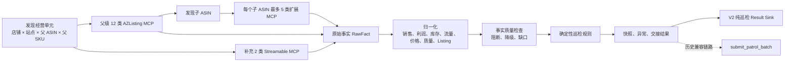

# 巡检数据来源与 MCP 成功率总账

> 统计日期：2026-08-06  
> 审计方式：只读取代码、配置和现存运行产物；未调用生产 MCP，未修改生产数据。  
> 最新主样本：200 个经营单元，199 个完成、1 个失败。  
> 历史统计：按 `runId + fact_key` 去重，避免 200 单元原报告和合并报告重复计算。

## 1. 执行结论

当前父级经营数据链路整体稳定，但尚未达到“完整巡检”的要求。

- 最新 200 个经营单元中，199 个完成，1 个失败。
- 最新批次父级与补充 MCP 共计划调用 2,786 次，成功 2,699 次，传输成功率为 **96.88%**。
- 87 次失败全部来自 `erp_listing_monthly_goal`，该工具成功率为 **112/199，56.28%**。
- `erp_listing_platform_activity` 虽然 199 次均调用成功，但 63 次返回空数据。
- 最新批次非空数据率为 **94.62%**。
- 199 个成功快照全部为 `PARTIAL`，没有 `COMPLETE`，平均事实完整度为 **68.64%**。
- 当时有 140/199 个单元能够拼出旧中控载荷，但“可以提交”不等于“巡检点位完整”。
- 历史 `submit_patrol_batch` 回执为 162/162 成功，但这是旧中控兼容链路，不能代表当前 V2 纯巡检 Result Sink 已完成正式验收。

## 2. 成功率口径

本项目必须区分三种成功，不能只看 MCP 是否返回成功。

| 层级 | 定义 | 示例 |
|---|---|---|
| MCP 传输成功 | MCP 调用未超时、未报错，并返回合同可解析响应 | `erp_listing_platform_activity` 返回成功 |
| 数据可用 | 调用成功且返回非空、字段可归一化 | 平台活动返回非空活动记录 |
| 巡检可判定 | 数据能够支撑对应点位和规则完成判断 | 有连续逐日同口径数据后才能判断趋势异常 |

因此，MCP 成功率高不代表巡检完整度高。成功但空数据、字段未映射、子体异步未回填，都可能导致巡检点位无法判定。

## 3. 整体数据流



## 4. 经营单元从哪里来

巡检的经营单元身份为：

```text
shopId + siteCode + parentAsin + parentSellerSku
```

负责人不参与唯一键，同一经营单元可以对应多个负责人。

| MCP | 用途 | 当前状态 |
|---|---|---|
| `sys_user_query` + `sprout_shop_query` | 获取有效运营负责人及店铺/站点权威映射 | `PRINCIPAL_DIRECTORY` 默认策略 |
| `erp_listing_follow_up_by_principal` | 按负责人×店铺查询父级 Listing | 默认全量父级发现工具 |
| `erp_amazon_listing_query_page` | 全量分页子体列表 | 兼容备用策略；缺父字段时不生成父级经营单元 |

当前限制：

- 外部合同状态仍为 `PENDING_OWNER_FREEZE`。
- 仓库没有保存经营单元发现过程的逐页调用台账，因此暂时无法计算发现 MCP 的真实调用成功率、空页率和漏数率。
- 外部 Tool 文档尚未正式冻结 `parentAsin` 和 `parentSellerSku` 的运行合同。
- 负责人单值如何从多人集合映射到中控 `ownerUserId` 仍需冻结。

## 5. 父级固定事实来源

每个父级经营单元正常调用 12 个 AZListing MCP，并调用 2 个 Streamable 补充 MCP。

### 5.1 最新 199 个成功运行

| MCP | 数据用途 | 核心性 | 成功率 | 成功但空数据 |
|---|---|---:|---:|---:|
| `erp_listing_product_info` | 子 ASIN、子 SKU、父子关系、状态、属性 | 核心 | 199/199，100% | 0 |
| `erp_asin_full_detail` | 父体前台状态、标题、图片、A+、价格、评分 | 核心 | 199/199，100% | 0 |
| `erp_listing_gross_profit_history` | 逐日销量、订单、销售额、广告和毛利 | 核心 | 199/199，100% | 0 |
| `erp_listing_stock_alert` | FBA 可售、在途和预留库存 | 核心 | 199/199，100% | 0 |
| `erp_listing_business_report` | Sessions、转化率和业务报告 | 可降级 | 199/199，100% | 0 |
| `erp_listing_natural_advert_flow` | 自然订单、广告订单和流量结构 | **当前停用** | 历史 199/199；新巡检不调用 | - |
| `erp_listing_unit_profit_analysis` | 单位贡献利润、成本和目标参数候选 | 可降级 | 199/199，100% | 0 |
| `erp_listing_inventory_cost_analysis` | 超龄库存、仓储费和库存成本 | 可降级 | 199/199，100% | 0 |
| `erp_listing_advert_agent_config` | 目标 ACOS 和目标预算 | 可降级 | 199/199，100% | 0 |
| `erp_listing_monthly_goal` | 月销量目标 | 可降级 | **112/199，56.28%** | 0 |
| `erp_listing_refund_rate` | 16/32 周退款率 | 可降级 | 199/199，100% | 0 |
| `erp_listing_platform_activity` | 平台活动和促销配置 | 可降级 | 199/199，100% | **63** |
| `sales_performance` | 历史补充销量、订单和月目标 | **已退役** | 不再调用 | - |
| `az_extend_detail` | Seller ID 和 Buy Box 归属辅助信息 | 补充源 | 199/199，100% | 0 |
| `listing_basic_info` | 父级星级和评论数补充 | 补充源 | 新接入，待真实批次统计 | - |

最新批次汇总：

| 指标 | 结果 |
|---|---:|
| 计划调用 | 2,786 |
| 成功 | 2,699 |
| 失败 | 87 |
| MCP 传输成功率 | **96.88%** |
| 成功但空数据 | 63 |
| 非空可用调用 | 2,636 |
| 非空数据率 | **94.62%** |

## 6. 子 ASIN 扩展事实来源

父级 `erp_listing_product_info` 返回子体后，每个具备 ASIN 和 Seller SKU 的子体最多调用以下 5 类 MCP。

| MCP | 支撑巡检点位 | 实际发起 | 成功 | 主动跳过/未发起 |
|---|---|---:|---:|---:|
| `erp_asin_full_detail` | 主图、图片、A+、链接、父子关系、属性 | 136 | **136/136，100%** | 320 |
| `erp_listing_price_promotion_analysis` | 促销、价格、类目和变体价差 | 136 | **136/136，100%** | 320 |
| `erp_amazon_account_health_issue` | 合规、账户健康和下架原因 | 136 | **136/136，100%** | 320 |
| `erp_listing_review_analysis` | 近期集中差评 | 56 | **56/56，100%** | 400 |
| `erp_listing_asin_keyword_rank_history` | 关键词排名和卡位异常 | 48 | **0/48，0%** | 305 |

说明：

- “主动跳过/未发起”不是 MCP 调用失败，不能放入实际调用成功率的分母。
- 关键词排名的 48 次属于真实调用失败，是当前表现最差的数据源。
- 最新 200 单元批次采用异步子体采集，199 个成功单元在报告生成时均尚未完成子体事实回填。
- 子体未回填会影响主图、图片、A+、链接、父子关系、属性、促销、变体价格、合规、评论和关键词卡位等点位。

## 7. 负责人、图片与经营模式

这些数据属于独立补充链路，不应混入父级固定事实 MCP 的成功率。

| 数据 | MCP/来源 | 用途 | 现存覆盖情况 |
|---|---|---|---:|
| 系统用户 | `sys_user_query` | 用户 ID、姓名、账号、角色、启用状态 | 无逐次调用台账 |
| 店铺身份 | `sprout_shop_query` | 店铺 ID、店铺账号和站点 | 无逐次调用台账 |
| ASIN 负责人 | `erp_listing_follow_up_by_principal` | 将负责人映射到经营单元 | 最新 `ownerUserId` 仅 1/199 |
| 商品图片补全 | `pangolinfo_api_sync_Extract` | 前台详情缺图时补主图 | 最新 `productPicUrl` 仅 1/199 |
| 当前经营模式 | `get_current_operating_modes`；缺失时 `start_operating_mode_evaluation_job` + `get_operating_mode_evaluation_job` | 查询权威结果；未命中自动跑评估并完成后二次查询 | 历史记录为只读旧链路；现行链路要求闭环复查 |

经营模式需要分别计算：

- MCP 响应成功率：3/3，**100%**。
- 有效经营模式覆盖率：0/3，**0%**。
- 最新 199 个快照中 `businessModel` 全部缺失。

巡检先调用批量只读 `get_current_operating_modes`；未命中必须调用自动评估任务并在终态后二次查询，不能调用手动写入型
`evaluate_operating_mode`；当二次查询结果不是
`DECIDED` 时，可使用 `erp_listing_advert_agent_config.operatingMode`，但必须标记为
`ADVERT_CONFIG_FALLBACK`，不能当作 OM Agent 权威结论。

负责人和图片目前只有字段覆盖率，没有逐次 MCP 运行记录，因此不能推导其 MCP 成功率。

## 8. 最终中控字段来源

| 中控字段 | 数据来源或计算方式 |
|---|---|
| `shopId`、`siteCode`、`parentAsin`、`parentSellerSku` | 经营单元发现结果 |
| `ownerUserId` | 负责人目录或经营单元返回的 `userId`；仅单负责人时写入 |
| `productName` | `erp_asin_full_detail`，必要时结合产品信息 |
| `productPicUrl` | `erp_asin_full_detail`，缺失时由 Pangolinfo 补全 |
| `businessModel` | `get_current_operating_modes` 闭环复查后的权威结果 |
| `metricDate` | 最新完整逐日经营记录日期 |
| `salesAmount`、`salesQuantity`、`orderQuantity` | 归一化后的逐日销售数据 |
| `adCost`、`adSalesAmount`、`adOrder` | 归一化后的逐日广告经营数据 |
| `contributionProfit` | `unit_contribution × salesQuantity` |
| `profitRate` | 逐日毛利率 |
| `availableInventory`、`inboundInventory`、`reservedInventory` | 库存告警和库存费用数据 |
| `tags` | 产品等级、阶段、广告方向等外部配置字段 |
| `anomalies`、`details` | 确定性巡检规则产出的真实异常和人工复核交接 |
| `factSnapshots` | 销售、利润、库存、价格和 Listing 五类归一化快照 |

## 9. 历史唯一运行汇总

按所有现存数据覆盖产物，以 `runId + fact_key` 去重：

| 指标 | 结果 |
|---|---:|
| 唯一运行 | 220 |
| 有运行结果 | 219 |
| 原始事实记录 | 5,210 |
| 主动跳过或明确未发 MCP | 1,665 |
| 实际发起 MCP | 3,545 |
| 成功 | 3,383 |
| MCP 传输成功率 | **95.43%** |
| 成功但空数据 | 64 |
| 非空可用调用 | 3,319 |
| 非空可用调用率 | **93.63%** |

主要真实失败：

| 数据源 | 真实失败次数 |
|---|---:|
| `erp_listing_monthly_goal` | 88 |
| `erp_listing_asin_keyword_rank_history` | 48 |
| `erp_listing_natural_advert_flow` | 8 |
| `erp_listing_product_info` | 7 |
| `erp_listing_stock_alert` | 3 |
| `erp_listing_refund_rate` | 2 |
| 其他父级 MCP | 各约 1 |

## 10. 中控回传情况

现存 8 份历史 `submit_patrol_batch` 回执：

| 指标 | 结果 |
|---|---:|
| 回执记录 | 162 |
| 成功 | 162 |
| 回执成功率 | **100%** |
| 唯一业务键 | 157 |

该链路会校验回执中的 `shopId + parentAsin + parentSellerSku` 与请求完全一致。任一单元失败，整批都会进入失败或重试处理。

必须注意：

- 这是历史兼容 `submit_patrol_batch` 的成功率。
- 当前 V2 主链路目标是纯巡检 Result Sink，不应强制巡检填写经营模式、建议、审批和执行动作。
- 当前默认配置中，调度、中控投递和经营模式查询均关闭。
- 历史 162/162 成功不能证明当前 V2 自动投递链路已经完成正式验收。

## 11. 当前巡检完整度

最新 199 个成功运行：

| 指标 | 结果 |
|---|---:|
| `COMPLETE` | 0 |
| `PARTIAL` | 199 |
| 平均事实完整度 | **68.64%** |
| 可拼出旧中控载荷 | 140/199，70.35% |

当前主要缺口：

| 缺口 | 影响单元数 | 影响 |
|---|---:|---|
| 子体异步事实未完成 | 199/199 | 14 类 Listing、变体、合规、评论和卡位点位不能完整判定 |
| 净现金回收证据缺失 | 199/199 | 退出、清货和现金可行性结论不能自动判定 |
| 逐日自然/广告流量序列 | 产品策略暂时停用 | 新巡检不调用、不派生，也不计为数据缺口；连续趋势点位不判定 |
| 月目标缺失 | 87/199 | 月目标偏离规则降级 |
| 平台活动返回空数据 | 63/199 | 促销一致性只能部分判定 |
| 负责人缺失 | 198/199 | 中控责任归属不完整 |
| 商品图片缺失 | 198/199 | 中控展示和图片类证据不完整 |
| 经营模式缺失 | 199/199 | 旧中控经营模式字段无法补齐 |
| 标签缺失 | 199/199 | 中控产品阶段和广告方向等标签为空 |

## 12. 当前最薄弱的五个数据源

1. **子体异步事实链路**：最新 199 个单元均未完全回填，影响最多巡检点位。
2. **关键词排名 MCP**：真实调用 48 次，成功 0 次。
3. **净现金回收数据**：199 个单元全部缺失，不能支持退出或清货判断。
4. **逐日自然/广告流量序列**：当前按产品决策主动停用，不进入新巡检数据缺口统计。
5. **月目标 MCP**：最新成功率只有 56.28%，是父级固定事实中最明显的不稳定源。

负责人、图片、经营模式和标签的覆盖同样很低，但由于缺少逐次调用台账，目前只能评价字段覆盖，不能准确评价其 MCP 成功率。

## 13. 是否符合巡检要求

当前评价为：**父级基础数据基本可用，完整巡检要求尚未满足。**

可以确认：

- 父级核心 MCP 在最新批次中运行稳定。
- 父级数据具备身份、销售、利润和库存的基础归一化能力。
- 历史中控兼容链路的接收结果稳定。
- 数据不足时会输出缺口，不会用默认值伪造完整事实。

尚不能确认：

- 所有经营单元发现无漏数。
- 所有子 ASIN 扩展事实已回填。
- 14 类受子体数据影响的巡检点位已完整执行。
- 净现金回收和逐日自然流量规则具备完整证据。
- 负责人、图片、经营模式和标签具备稳定覆盖。
- 当前 V2 纯巡检 Result Sink 已完成生产 E2E 验收。

因此目前可以表述为“父级 MCP 可用性较好，历史中控接收稳定”，不能表述为“全量巡检已完整覆盖”。

## 14. 证据索引

- 父级与子体采集逻辑：`facts/collector.py`
- MCP 合同与 Tool 清单：`clients/azlisting_contract.py`
- 事实归一化：`facts/normalizer.py`
- 数据质量与缺口判定：`facts/quality.py`
- 经营单元发现：`integrations/mcp_operating_units.py`
- 全量经营单元目录：`t_patrol_operating_unit_catalog`，由 `erp_amazon_listing_query_page` 全量分页刷新，默认 7 天更新一次；批量巡检只读取该目录，不从历史巡检任务反推身份。
- 负责人目录：`integrations/owner_directory.py`
- 图片补全：`integrations/pangolinfo_product.py`
- 中控合同：`core/control_center_contracts.py`
- 中控投递：`integrations/control_center_delivery.py`
- 当前运行配置：`config/settings.yaml`
- 外部合同边界：`docs/16-外部合同冻结与E2E联调清单.md`
- 最新 200 单元报告：`artifacts/data-coverage/batch_ce9df679f692475e87aeca34-merged.json`
- 历史中控回执：`artifacts/control-center-delivery/`
